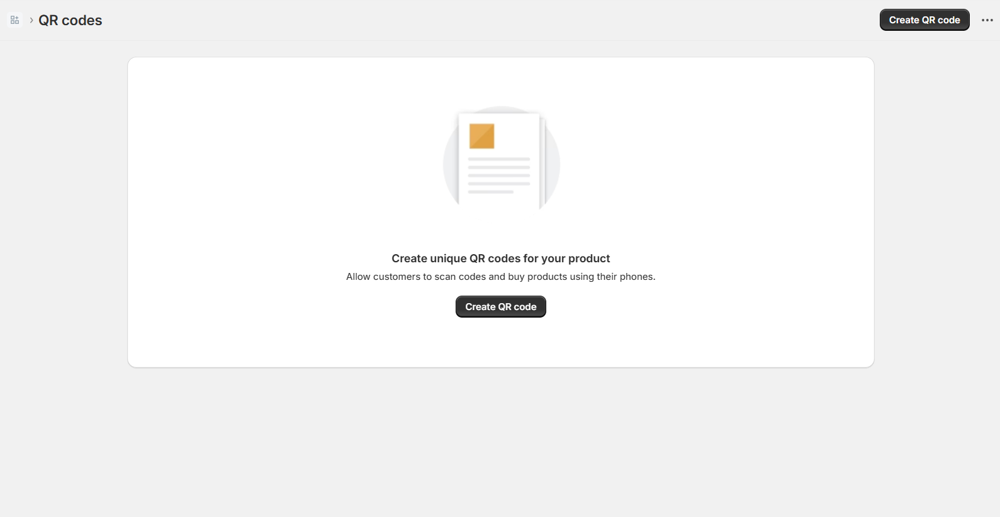
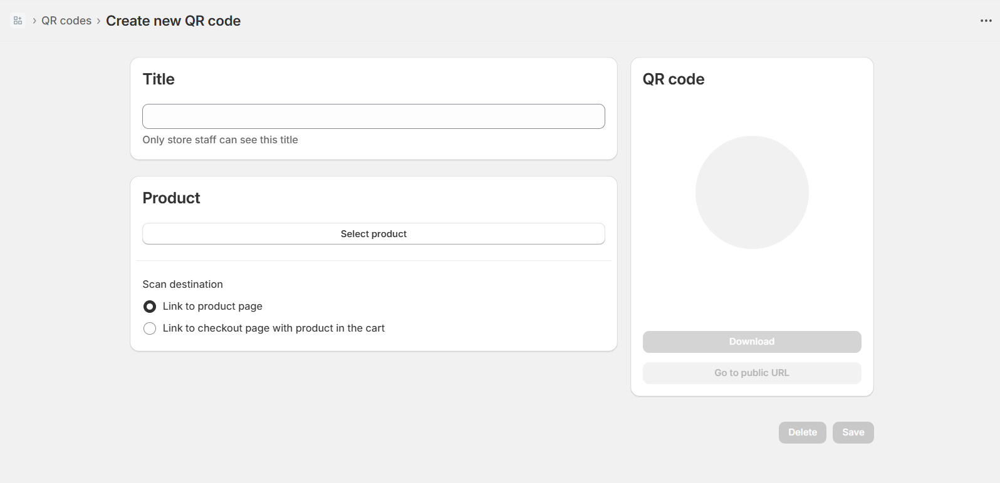
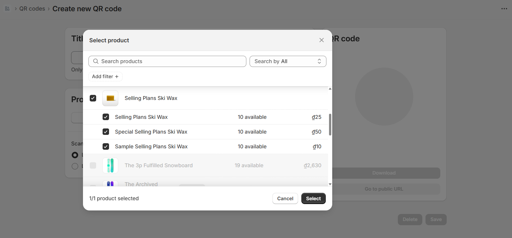
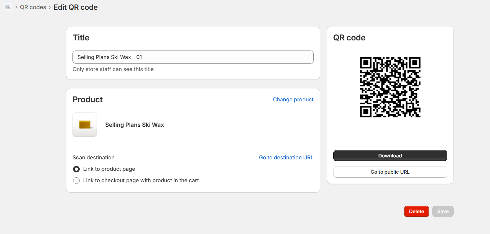

# Shopify QR Code App with Remix

This is a sample Shopify app built with [Remix](https://remix.run/), using the official [@shopify/shopify-app-remix](https://www.npmjs.com/package/@shopify/shopify-app-remix) package.

- The app allows merchants to **generate QR codes for their products**.
- When a QR code is scanned, it redirects the customer to either a checkout page preloaded with the product, or to the product detail page.
- Every QR code scan is logged and scan analytics are shown inside the app.

---

## 🚀 Features

- ✅ Generate QR codes for Shopify products
- ✅ Redirect customers to product or checkout pages
- ✅ Track and store QR code scans
- ✅ View scan metrics in the app dashboard
- ✅ Seamless authentication with Shopify
- ✅ Fully responsive UI using [Shopify Polaris](https://polaris.shopify.com/)
- ✅ Interactivity with [Shopify App Bridge](https://shopify.dev/docs/apps/tools/app-bridge)

---

## 🛠 Tech Stack

- [Remix](https://remix.run/)
- [Shopify App Bridge](https://shopify.dev/docs/apps/tools/app-bridge)
- [Polaris React](https://polaris.shopify.com/)
- [Prisma ORM](https://www.prisma.io/)
- [QRCode Generator (npm `qrcode`)](https://www.npmjs.com/package/qrcode)

---

## Demo

